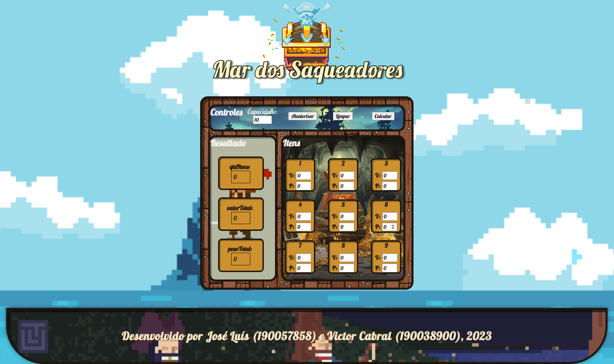
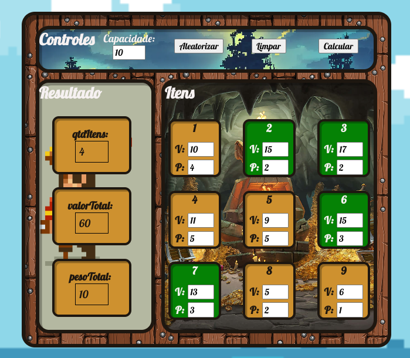
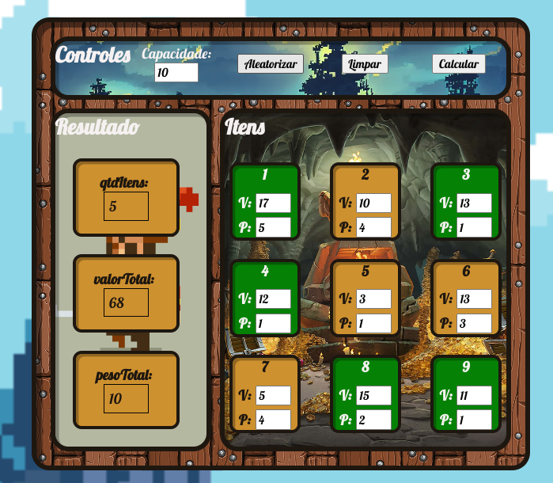

# Ilhas Vizinhas

**Número da Lista**: 37 
**Conteúdo da Disciplina**: Programação Dinâmica 

## Alunos
|Matrícula | Aluno |
| -- | -- |
| 19/0057858  |  José Luís Ramos Teixeira |
| 19/0038900  |  Victor de Souza Cabral |

## Sobre 
O "Mar dos Saqueadores" é um projeto que utiliza o conceito de programação dinâmica para resolver o problema da mochila em um jogo com temática pirata.

O objetivo do jogo é preencher uma mochila de capacidade limitada com tesouros, maximizando o valor total dos tesouros coletados. Os jogadores podem interagir com o jogo através dos controles disponíveis.

Você terá uma experiência interativa na qual desafia os jogadores a tomarem decisões estratégicas sobre quais tesouros coletar para maximizar seus ganhos enquanto lidam com a limitação de espaço na mochila.

## Screenshots

## Vídeo de Apresentação

**Conteúdo:** Programação Dinâmica.

Vídeo contendo explicação da projeto para entrega da unidade 5.

## Instalação 
**Linguagem**: HTML, CSS e JavaScript 
**Framework**: Não há necessidade de instalar nenhum framework. Para rodar o projeto, basta clonar o repositório e abrir o arquivo index.html no navegador ou acessar o link. 

## Uso 
**Acessar o link:** <https://projeto-de-algoritmos.github.io/PD_MarDosSaqueadores/>

Na seção de controles temos um campo para controlar a capacidade da mochila, além de botões para aleatorizar os valores dos tesouros, limpar os valores e calcular os resultados.

Os resultados são exibidos em uma seção separada, onde são mostrados o número total de tesouros coletados, o valor total dos tesouros e o peso total dos tesouros na mochila.

A seção de itens mostra uma lista de tesouros disponíveis. Cada tesouro é representado por um número, seguido por campos de entrada para especificar o valor e o peso do tesouro. Os jogadores podem inserir valores para cada tesouro manualmente ou utilizar o botão "Aleatorizar" para gerar valores aleatórios. 

Ao clicar no botão "Calcular", o jogo utiliza o algoritmo de programação dinâmica para determinar a melhor combinação de tesouros a serem colocados na mochila, considerando a capacidade da mochila informada. Os tesouros selecionados são marcados em verde e os resultados são atualizados.

## Outros 
Este projeto foi criado como parte do curso de Projeto de Algoritmos da Faculdade do Gama - Universidade de Brasília (FGA-UnB). Qualquer sugestão ou contribuição é bem-vinda.

